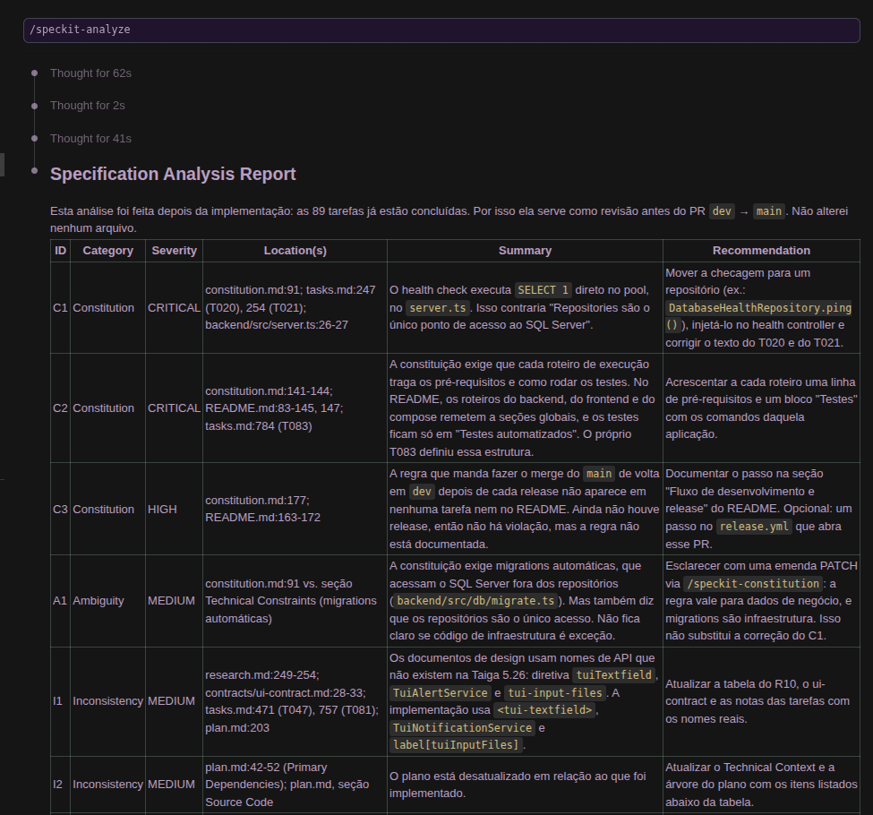
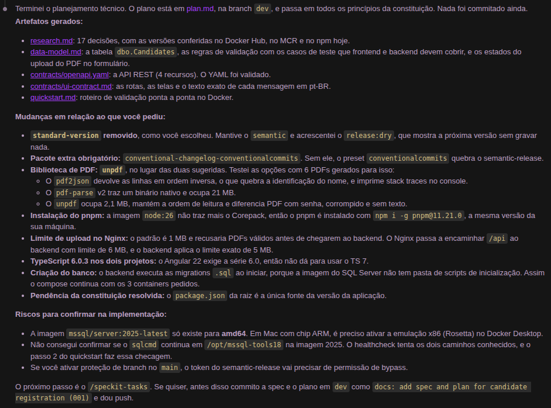

# DESENVOLVIMENTO

Registro de rastreabilidade do desafio **CIEE-PR Challenge**, que é um cadastro e consulta de
candidatos com importação de currículo em PDF. Este documento é um entregável obrigatório da
[constituição do projeto](.specify/memory/constitution.md) (Princípio VII).

## Sumário

1. [Organização e execução do trabalho](#1-organização-e-execução-do-trabalho)
2. [Principais decisões técnicas e justificativas](#2-principais-decisões-técnicas-e-justificativas)
3. [Ferramentas de IA e modelos utilizados](#3-ferramentas-de-ia-e-modelos-utilizados)
4. [Exemplos práticos de onde a IA ajudou](#4-exemplos-práticos-de-onde-a-ia-ajudou)
5. [Ajustes, correções e descartes sobre o código gerado por IA](#5-ajustes-correções-e-descartes-sobre-o-código-gerado-por-ia)
6. [Processo de validação e testes](#6-processo-de-validação-e-testes)
7. [Tempo real dedicado ao desafio](#7-tempo-real-dedicado-ao-desafio)
8. [Dificuldades, limitações da extração de PDF e melhorias futuras](#8-dificuldades-limitações-da-extração-de-pdf-e-melhorias-futuras)

---

## 1. Organização e execução do trabalho

O trabalho seguiu o fluxo de **Spec-Driven Development** do [Spec Kit](https://github.com/github/spec-kit).
Cada etapa gerou um artefato versionado, e a etapa seguinte partiu dele:

| Etapa | Comando | Artefato |
|-------|---------|----------|
| Princípios do projeto | `/speckit-constitution` | [`.specify/memory/constitution.md`](.specify/memory/constitution.md) (v1.0.0, depois v1.1.0 e v1.2.0) |
| Especificação funcional | `/speckit-specify` | [`spec.md`](specs/001-candidate-registration/spec.md): 3 histórias de usuário, 30 requisitos, 8 critérios de sucesso |
| Esclarecimento de ambiguidades | `/speckit-clarify` | Seção *Clarifications* da spec (4 perguntas respondidas) |
| Plano técnico | `/speckit-plan` | [`plan.md`](specs/001-candidate-registration/plan.md), [`research.md`](specs/001-candidate-registration/research.md) (R1 a R17), [`data-model.md`](specs/001-candidate-registration/data-model.md), [`contracts/`](specs/001-candidate-registration/contracts/), [`quickstart.md`](specs/001-candidate-registration/quickstart.md) |
| Quebra em tarefas | `/speckit-tasks` | [`tasks.md`](specs/001-candidate-registration/tasks.md): 89 tarefas por história de usuário |
| Implementação | `/speckit-implement` | `backend/`, `frontend/`, `samples/`, compose, workflows; tarefas marcadas `[X]` |

**Como conduzi o trabalho.** Levei cerca de 2 h para projetar a especificação e escolher as
ferramentas. Nessa fase, usei o Gemini 3.6 Flash (com *Thinking*) para refinar meus prompts antes
de enviá-los ao Claude (Opus 5.5, com esforço *Extra High* no planejamento). Depois segui o fluxo
do Spec Kit e, por fim, fiz ajustes finos: o limite máximo dos campos e a responsividade visual
ao inserir textos longos.

**Fluxo de branches** (constituição v1.1.0): todo o desenvolvimento acontece em `dev`. A
integração no `main` é feita só por Pull Request com *merge commit*. O `semantic-release`
roda no `main`, então cada release reúne vários commits de `dev`.

**Ordem de execução**: Setup → Fundação → US1 → US2 → US3 → Polimento. Cada fase terminou com
um *checkpoint* executado contra a stack real no Docker, e a próxima só começou depois dele:

1. **Fundação**: `docker compose up` com os 3 containers saudáveis e a migration aplicada.
2. **US1** (cadastro manual): criação com 201, e-mail duplicado com 409 e validação com 400,
   contra o SQL Server real.
3. **US2** (consulta): listagem, detalhes e 404.
4. **US3** (currículo em PDF): as 8 amostras enviadas pelo Nginx.

Dentro de cada história, os testes foram escritos **antes** da implementação e confirmados
falhando.

## 2. Principais decisões técnicas e justificativas

**Escolha da stack.** Escolhi Angular, Node.js e pnpm por ter mais familiaridade com essas
ferramentas. A exceção é o kit de UI: optei pela Taiga UI para usar algo diferente do Material,
que é o mais comum, aproveitando a facilidade de implementação via *skill*. Isso consumiu menos
tokens e menos prompts, com resultados mais rápidos e consistentes, sem tanta tentativa e erro.

**Emendas da constituição** (registradas aqui, como a governança exige): v1.1.0 introduziu o
fluxo `dev` → PR → `main` com *merge commit*; v1.2.0 passou a pedir no item 7 deste documento
só o tempo real (aproximado), alinhado ao enunciado do desafio, porque não houve estimativa
prévia.

As justificativas técnicas completas, com as alternativas avaliadas, estão no
[research.md](specs/001-candidate-registration/research.md). Resumo:

| Tema | Decisão | Por quê |
|------|---------|---------|
| Arquitetura do backend | Express 5 com camadas Controller → Service → Repository e injeção manual (`createApp(deps)`) | Separação explícita e fácil de auditar (constituição V). Os services são testáveis com fakes, sem banco |
| Extração de PDF | **unpdf** (pdf.js), isolado atrás da interface `PdfTextExtractor`; heurísticas num parser puro (`ResumeFieldParser`) | Um spike com 6 PDFs mostrou que o `pdf2json` devolve as linhas em ordem inversa e que o `pdf-parse` v2 traz um binário nativo de 21 MB. O `unpdf` tem 2 MB, mantém a ordem de leitura e lança erros tipados (senha, arquivo corrompido) |
| Acesso ao banco | Driver `mssql` com SQL parametrizado; sem ORM | Uma tabela e três consultas; os scripts SQL continuam legíveis, como foi pedido |
| Criação do schema | Migrations `.sql` versionadas, aplicadas pelo backend na inicialização (`dbo.SchemaMigrations`) | A imagem do SQL Server não tem pasta de scripts de inicialização. Assim o compose mantém os 3 containers pedidos, e a imagem do banco continua a oficial |
| E-mail único | Coluna `COLLATE Latin1_General_100_CI_AS` + `UNIQUE` | O banco trata `Maria@x.com` e `maria@x.com` como iguais, mesmo com duas gravações ao mesmo tempo. Não é preciso consultar antes de inserir |
| Mesmas regras nos dois lados | Uma única tabela de regras (data-model §2), implementada com zod no backend e com validadores Angular no frontend, e testada com **os mesmos casos** | Os projetos pnpm são independentes (um contexto Docker por app), então duplicar ~5 regras custou menos que montar um workspace |
| Frontend ↔ API | Nginx serve o SPA e faz proxy de `/api` para `backend:3000`, com `client_max_body_size 6m` | Não há CORS nem URL de API fixada no build. Sem o ajuste, o limite padrão de 1 MB do Nginx recusaria PDFs válidos |
| Estado no Angular | Sinais (`CandidatesStore`) e Reactive Forms tipados; `toSignal(form.events)` para renderizar os erros em modo zoneless | Estado reativo exigido pela constituição, sem biblioteca extra |
| Upload | multer em **memória** (limite de 5.242.880 bytes) e checagem da assinatura `%PDF-`, não da extensão | O PDF nunca é gravado em disco e é descartado depois da resposta (FR-024, LGPD) |
| Versionamento | semantic-release no `main` (GitHub Actions), `releaseRules` customizadas, `CHANGELOG.md` e `package.json` da raiz | Constituição III. O `package.json` da raiz é a única fonte da versão da aplicação |
| TypeScript | 6.0.3 nos dois projetos, `strict` | O Angular 22 só aceita nativamente a série 6.0 (o TypeScript 7, reescrito em Go e mais rápido, ficou de fora); usar a mesma versão nos dois lados evita diferenças de checagem |
| Imagem Node | `node:26.10-bookworm-slim` + `npm i -g pnpm@11.21.0` | O Node 25+ não traz mais o Corepack |

## 3. Ferramentas de IA e modelos utilizados

| Ferramenta | Uso |
|------------|-----|
| **Spec Kit** 1.0.11 (integração Claude, modo *skills*) | Estruturou o fluxo constitution → specify → clarify → plan → tasks → implement e os templates de cada artefato |
| **Claude Code** com o modelo **Claude Opus 5.5** (`claude-opus-5-5`), com esforço *Extra High* no planejamento | Constituição, spec, esclarecimentos, plano e tarefas; consulta de versões nos registries (Docker Hub, MCR, npm); spike de bibliotecas de PDF; implementação; testes E2E com Playwright; documentação |
| **Gemini 3.6 Flash** (modo *Thinking*) | Refinar os prompts antes de enviá-los ao Claude, na fase de especificação e escolha de ferramentas |

## 4. Exemplos práticos de onde a IA ajudou

O Spec Kit deixa claro, visualmente, o que depende da minha validação e já traz recomendações
de correção. Um exemplo é o relatório do `/speckit-analyze`, rodado depois da implementação, em
que cada achado vem com a severidade, o local e a correção sugerida:



1. **Constituição a partir de uma lista de princípios.**
   - *Pedido*: `/speckit-constitution` com os 7 princípios (stack, pnpm, semantic-release,
     `.env`, Clean Architecture, testes, documentação).
   - *Resposta*: regras verificáveis (DEVE/DEVERIA), mais quality gates de merge e regras
     derivadas: lockfile versionado, `strict: true`, PDFs de exemplo só com dados fictícios.
   - *Aproveitamento*: virou a checagem de conformidade de cada plano. Depois foi emendada
     (v1.1.0) com o fluxo `dev` → `main`.
2. **Ambiguidades do enunciado.**
   - *Pedido*: `/speckit-clarify`.
   - *Resposta*: 4 decisões que o enunciado não cobria (e-mail duplicado, retenção do PDF,
     login, tamanho mínimo do telefone), cada uma com opções e uma recomendação.
   - *Aproveitamento*: as respostas viraram requisitos testáveis (FR-012, FR-024, FR-004)
     e premissas da spec.
3. **Checagem de versões antes de planejar.**
   - *Pedido*: `/speckit-plan` com as versões desejadas (Node 26.10, Angular 22, Taiga UI
     5.26.0, SQL Server 2025).
   - *Resposta*: todas foram conferidas nos registries, e surgiram três problemas antes de
     escrever código:
     - A imagem do Node 26 não traz o Corepack.
     - O Angular 22 exige TypeScript 6.0.
     - O script `prerelease` roda automaticamente antes de `release`. Isso foi testado com
       o pnpm e o npm.
   - *Aproveitamento*: ajustes no plano (seção "Ajustes em relação à entrada") e uma decisão
     do autor sobre o `standard-version` (seção 5).

   <details>
   <summary>Prompt enviado ao <code>/speckit-plan</code></summary>

   ```text
   /speckit-plan Defina o plano técnico com as seguintes versões específicas:
   - Node.js: node:26.10-bookworm-slim
   - Angular: v22 usando Taiga-UI (v5.26.0) como UI Kit
   - SQL Server: `mcr.microsoft.com/mssql/server:2025-latest`
   - Biblioteca de parsing de PDF no backend: Escolher uma biblioteca leve em Node.js
     (ex: `pdf-parse` ou `pdf2json`) com isolamento da lógica de extração em um serviço dedicado.

   Configuração de Release & Versionamento (`package.json`):
   - Incluir dependências: `semantic-release`, `@semantic-release/commit-analyzer`,
     `@semantic-release/release-notes-generator`, `@semantic-release/changelog`,
     `@semantic-release/npm`, `@semantic-release/github`, `@semantic-release/git`.
   - Scripts no `package.json`:
     - `"release": "standard-version"`
     - `"prerelease": "standard-version --prerelease preview"`
     - `"semantic": "semantic-release --branches main"`
   - Configurar chave `"release"` no `package.json` com preset `conventionalcommits`,
     plugins e regras de release.

   Estrutura de Containers (docker-compose.yml):
   1. db: SQL Server (1433:1433); volume persistente e Healthcheck configurado para garantir
      disponibilidade do banco.
   2. backend: API Node.js rodando no container, dependente da saúde do container db
      (depends_on com condition: service_healthy); Mapeamento de porta 3000:3000.
   3. frontend: App Angular v22 (Multi-stage build: Mesmo node para build com pnpm, Nginx alpine
      para servir); Mapeamento da porta 4200 (host) para porta 80 (Nginx); Dependente do serviço
      backend.

   Estrutura de Banco de Dados:
   - Scripts SQL de Migration/Initialization automatizados para criação da tabela de candidatos
     no SQL Server na inicialização do container.

   Estrutura de Arquivos de Documentação a Gerar:
   - README.md: Guia de passo a passo para clonar, copiar `.env.example` para `.env`, executar
     `docker-compose up --build`, testar com o arquivo da pasta `samples/` e descrição de
     tecnologias/versões.
   - DESENVOLVIMENTO.md: Estruturado com sumário navegável abordando todos os 8 pontos da
     Constituição.
   ```

   </details>
4. **Spike de bibliotecas de PDF.**
   - *Pedido*: escolher uma biblioteca leve (ex.: `pdf-parse` ou `pdf2json`).
   - *Resposta*: um script gerou PDFs de teste (uma coluna, duas colunas, só imagem, com
     senha, corrompido, ZIP renomeado) e comparou as bibliotecas (tabela no R3).
   - *Aproveitamento*: a escolha do `unpdf`, e o formato dos PDFs de `samples/`. A própria IA
     testou qual biblioteca se encaixava melhor, logo depois do prompt acima, e mostrou o
     resultado no resumo do plano:

     
5. **Implementação guiada pelas tarefas.**
   - *Pedido*: `/speckit-implement`.
   - *Resposta*: as 89 tarefas executadas em ordem, com testes antes do código e checkpoints
     no Docker. No fim, um roteiro E2E com Playwright (28 verificações) exercitou a interface
     real: máscara de telefone, upload, mensagens e navegação.
   - *Aproveitamento*: o roteiro encontrou problemas de acessibilidade que os testes em jsdom
     não pegavam (seção 5).

## 5. Ajustes, correções e descartes sobre o código gerado por IA

Durante a implementação, analisei as atividades entregues e pedi correções pontuais, como a do
healthcheck (acesso ao banco fora do repositório, item C1 da análise) e pequenos casos para
completar a cobertura de testes.

**Descartes feitos no planejamento:**

- **`standard-version` descartado.** Os scripts `release` e `prerelease` pedidos para o plano
  conflitavam com a constituição (versão só pelo semantic-release, no `main`). A ferramenta
  está sem release desde 2022, e `prerelease` roda como hook antes de `release`, gerando duas
  versões por execução. O autor decidiu usar só o semantic-release, e foi criado o script
  `release:dry`.
- **Biblioteca de PDF trocada** de `pdf-parse`/`pdf2json` para `unpdf`, depois do spike (seção
  2).
- **Dependência obrigatória acrescentada**: `conventional-changelog-conventionalcommits`. Sem
  ela, o preset `conventionalcommits` quebra o semantic-release.

**Correções feitas durante a implementação**, quando o plano não bateu com as versões reais
das ferramentas:

| Problema encontrado | Correção |
|---------------------|----------|
| O pnpm 11 bloqueia scripts de build de dependências por padrão (`ERR_PNPM_IGNORED_BUILDS` com `esbuild`, `lmdb`...) | Aprovação explícita em `pnpm-workspace.yaml` (`allowBuilds`) em cada projeto, também copiado nos Dockerfiles |
| O tema da Taiga UI usa `.less` e o build falhou sem o compilador | `less` adicionado às devDependencies do frontend |
| Os testes da Taiga no jsdom falharam (`TUI_OPTIONS` sem provider; `matchMedia`, `ResizeObserver` ausentes) | `src/test-providers.ts` (`providersFile` do builder) e `src/test-setup.ts` com polyfills |
| APIs da Taiga 5 diferentes do plano: não existe `TuiAlertService` (é `TuiNotificationService`); tabela e "block status" ficam em pacotes separados | Uso de `TuiNotificationService`; `@taiga-ui/addon-table` e `@taiga-ui/layout` adicionados (5.26.0) |
| Tokens de CSS antigos (`--tui-font-heading-4`) não existem na Taiga 5, e os títulos apareceram sem estilo nas capturas do E2E | Troca para `--tui-typography-heading-h4` e `--tui-typography-body-m` |
| `pdf.destroy()` não existe no pdf.js atual | `pdf.loadingTask.destroy()` no `finally` do extrator |
| Acessibilidade: o Playwright mostrou que os `<label tuiLabel>` não ficavam associados aos campos e que a Taiga sobrescreve o `aria-describedby` | Associação explícita com `for`/`id`; `aria-errormessage` apontando para o `tui-error`; nome acessível no campo de arquivo |
| Teste do error handler manipulava a pilha interna do Express | Trocado por um app Express mínimo com o `createErrorHandler` |
| Healthcheck do SQL Server com dois caminhos possíveis do `sqlcmd` | O caminho `/opt/mssql-tools18/bin/sqlcmd` foi confirmado na imagem 2025, e o healthcheck foi simplificado |
| Instrução do README para rodar o frontend sozinho (`docker network connect --alias`) falharia com o container já conectado | Uso de `--network-alias backend` no `docker run` do backend. Os dois roteiros foram executados e validados |
| O primeiro release no `main` falhou com `Missing helper`: o `conventional-changelog-conventionalcommits` 10 exige o `conventional-changelog-writer` 9, mas o `release-notes-generator` 14.1.1 (a versão mais recente) ainda usa o 8 | Preset fixado em `^9.3.1`. As notas da versão foram geradas localmente com a config do `package.json` antes de um novo merge |

**Correções vindas do `/speckit-analyze`**, a análise de consistência feita depois da
implementação:

| Problema encontrado | Correção |
|---------------------|----------|
| O health check executava `SELECT 1` no `server.ts`, fora da camada de repositório, contrariando a regra da constituição (Princípio V) | Criados o `HealthService` e o `DatabaseHealthRepository`: o health segue Controller → Service → Repository, com testes unitários do service |
| Os roteiros do README não traziam pré-requisitos nem testes próprios, como exige a constituição (Princípio VII) | Pré-requisitos e testes em cada roteiro. Os testes rodam em containers (estágio `test` nos Dockerfiles), sem precisar de Node local |
| A constituição exige o merge do `main` de volta em `dev` depois de cada release, e isso não estava documentado | Comando incluído na seção de release do README |
| No frontend, `pnpm test` travava num terminal interativo: o Angular CLI perguntava sobre telemetria e depois entrava em modo watch | `"cli": { "analytics": false }` no `angular.json`, e `test` passou a ser execução única (`test:watch` para o modo contínuo) |
| O SC-008 (desempenho da listagem) não tinha um roteiro de verificação | Novo passo 4.1 no quickstart, executado exatamente como está escrito |

**Correções vindas da revisão manual do autor:**

| Problema encontrado | Correção |
|---------------------|----------|
| O campo "Resumo profissional" não crescia com o texto: a Taiga 5 limita o `tuiTextarea` a 3 linhas por padrão e o resto rolava dentro de uma caixa pequena | `[min]="4"` e `[max]="40"` linhas: o campo cresce com o conteúdo e cabe os 1000 caracteres mesmo num celular |
| O resumo aceitava mais de 1000 caracteres: o `[limit]` da Taiga só mostra o contador e marca o erro | `maxlength` nativo: a digitação para em 1000 e a colagem é cortada. Medido no navegador: 995 + 20 digitados → 1000; 1500 colados → 1000 |
| Na largura de celular (375 px), a tabela da listagem (~620 px) fazia a página inteira rolar na horizontal | A tabela fica numa região com rolagem horizontal própria (focável pelo teclado); a página mantém a largura da tela |
| Área de soltar do PDF apertada e sem indicação visual de envio de arquivo | Área com 144 px de altura e ícone de upload (`@tui.cloud-upload`) centralizado acima do texto. O seletor inclui `label[tuiInputFiles]` para vencer a regra `[data-size]` da Taiga sem `!important`. O teste do texto também pegou um espaço que o Angular removia ("arquivoou") |
| A listagem não tinha paginação | Paginação **no servidor**, com 10 por página por padrão (`GET /api/candidates?page=&pageSize=`, `OFFSET/FETCH` no SQL Server e total no mesmo lote). Na tela, o rodapé segue o exemplo "Footer" da tabela da Taiga (`caption[tuiCaption]`): total ("25 candidatos", no lugar do "999 rows" do exemplo), botão `tuiButtonSelect` "Exibindo X–Y" com `tui-data-list-wrapper` (10, 20 ou 50 por página) e `tui-pagination`. Página e tamanho ficam na URL (`?pagina=N&itens=M`); ao trocar o tamanho, a nova página é a que contém o primeiro item exibido; "Voltar para a lista" volta à mesma página e tamanho. A spec, o contrato e as tarefas (fase 7) foram atualizados antes do código |
| Na listagem, uma área de interesse longa **sem espaços** (250 caracteres de teste) não quebrava: sem ponto de quebra, a coluna ficou com 1.711 px e a tabela, com 2.283 px, mesmo no desktop | `overflow-wrap: anywhere` nas células e colunas com largura fixa (`table-layout: fixed`). Sem as larguras fixas, a quebra funcionava, mas a coluna da área tomava o espaço das outras e os e-mails quebravam em 3 linhas. Validado a 1.200 px e 375 px |
| Cores padrão da Taiga no lugar da identidade CIEE | Paleta CIEE (azul `#00458c`, laranja `#e86c00`, textos, fundos e links) em `frontend/src/styles.scss`. Os nomes pedidos seguiam a nomenclatura antiga da Taiga (`--tui-primary`, `--tui-text-01`, `--tui-link`...), que não existe na v5; foram mapeados para os tokens atuais (`--tui-background-accent-1`, `--tui-text-primary`, `--tui-text-action`...). O seletor inclui `[tuiTheme]`, porque a Taiga também declara os tokens ali. Conferido no navegador: os 13 tokens valem dentro do `tui-root`, e botões, links, paginação e erros usam as cores novas. Por decisão do autor, o laranja não é usado em nenhum elemento além do hover de links definido na paleta. O fundo da página passou a usar `--tui-background-elevation-1` (`#f4f7fa`) |
| Botões "Novo candidato" e "Salvar" só com texto | Ícones da Taiga via `iconStart`: `@tui.user-plus` e `@tui.save`. O ícone é desenhado por CSS e não muda o nome acessível dos botões |
| O hover das linhas da listagem não aparecia: a cor ia no `tr`, mas o `td` da Taiga pinta o próprio fundo branco por cima | Destaque aplicado às células (`--tui-background-elevation-2`, `#e9eef3`) no hover e quando o link da linha recebe foco pelo teclado (`:focus-within`) |
| Toasts no canto superior direito (padrão da Taiga) | Posição global centralizada no topo (`tuiNotificationOptionsProvider`, no `app.config.ts`). O provider na raiz leva o módulo de notificações para o bundle inicial (+8,6 kB comprimidos, antes carregados sob demanda). Por isso o limite de aviso do bundle inicial passou de 500 kB para 550 kB |

**Correções vindas do `/speckit-converge`**, a verificação de lacunas entre spec, plano, tarefas e
código:

| Problema encontrado | Correção |
|---------------------|----------|
| A spec diz que anexar outro PDF substitui o anterior, mas era preciso remover o arquivo antes | Botão "Trocar arquivo" junto ao arquivo escolhido: o novo PDF substitui o atual e preenche só os campos ainda vazios; um arquivo inválido mostra a mensagem e mantém o atual. Validado no navegador (03 → 04: só o telefone veio do 2º PDF) |
| Decisões visuais da revisão (paleta, ícones, toasts, área de soltar, destaque das linhas) documentadas só no ui-contract e aqui | Registradas também no `plan.md` (Technical Context, "UI e identidade visual") |

**Falsos alarmes investigados e descartados**: duas falhas do roteiro E2E (erros que
"não apareciam" e mensagens antigas depois do PDF) eram só o roteiro lendo a tela antes do
ciclo de renderização zoneless. O estado dos controles já estava correto no mesmo instante.

## 6. Processo de validação e testes

Resultados da validação final, feita em 2026-09-29 a partir de um ambiente zerado
(`docker compose down -v` e `.env` recém-copiado do `.env.example`):

| Gate / verificação | Resultado |
|--------------------|-----------|
| Build TypeScript `strict`: backend (`tsc`) e frontend (`ng build`) | ✅ sem erros |
| Testes do backend (Vitest + supertest) | ✅ **118 testes**, 12 arquivos |
| Testes do frontend (Vitest + jsdom) | ✅ **108 testes**, 13 arquivos (cada componente com seu `*.spec.ts`) |
| `docker compose up --build` do zero | ✅ os 3 containers saudáveis em **28 s** (com imagens em cache), migration aplicada automaticamente |
| Roteiro E2E no navegador (Playwright + Chromium, contra o compose) | ✅ **28/28** verificações, mais 12/12 da paginação e da quebra de texto e 10/10 do rodapé (itens por página) |
| Roteiro do [quickstart.md](specs/001-candidate-registration/quickstart.md) (API e interface) | ✅ todos os cenários |
| Roteiros do README para rodar backend e frontend separadamente | ✅ executados como estão escritos |
| Testes em containers (`docker build --target test`), sem Node local | ✅ 118 no backend e 108 no frontend |
| Commitlint (`hotfix`/`breaking` aceitos, mensagem livre recusada) e `pnpm release:dry` | ✅ |
| Revisão de segurança: sem segredos versionados, `.env` ignorado, sem `X-Powered-By`, nenhum PDF gravado em disco, logs sem dados pessoais | ✅ |

**Validação manual do autor.** Fiz uma análise primária do banco pelo DBeaver, para confirmar a
conexão e a inserção dos dados. Depois revisei os cenários do código que tratam dos envios à API
e os testes, para validar as regras de negócio.

**Critérios de sucesso medidos:**

- **SC-002**: nas amostras 01 a 04, os três campos foram extraídos corretamente em **100%**
  dos casos. O teste de integração compara com `samples/expected.json`.
- **SC-003**: os PDFs de exemplo foram processados entre **2 e 72 ms**, com timeout
  configurado em 4 s.
- **SC-004 e SC-005**: arquivo inválido, grande demais, com senha, corrompido e sem texto
  mostram a mensagem esperada, e o cadastro manual funciona em seguida. Verificado no E2E.
- **SC-006**: dados inválidos enviados direto à API são recusados com 400, e os CHECK
  constraints do banco são uma segunda barreira.
- **SC-007**: os detalhes abrem com 1 clique na linha da listagem.
- **SC-008**: com **1.002 candidatos**, `GET /api/candidates` respondeu em **~20 ms** pelo
  Nginx.

**Tipos de teste:**

- **Unitários**: regras de validação (os mesmos casos nos dois lados), services com repositório
  e extrator falsos, heurísticas do parser, configuração, divisão de lotes das migrations.
- **HTTP**: todos os endpoints com o app real e dependências falsas, conferindo status e formato
  de erro do contrato.
- **Integração**: o extrator real com os PDFs de `samples/`.
- **Componentes Angular**: renderização, mensagens, estados de carregamento, vazio e erro,
  envio duplo e a máquina de estados do PDF.

## 7. Tempo real dedicado ao desafio

| Etapa | Tempo real (aproximado) |
|-------|-------------------------|
| Especificação, plano e escolha das ferramentas (Spec Kit) | ~2 h |
| Implementação, com ajustes | 4 a 5 h |
| Validação (testes manuais, correções e pedidos à parte) | incluída nas etapas acima |
| **Total** | **~6 h** |

A maior parte do tempo de implementação foi o próprio Claude implementando e testando. A minha
parte foi analisar o que foi entregue e pedir correções.

## 8. Dificuldades, limitações da extração de PDF e melhorias futuras

### Dificuldades

- **Versões recentes com mudanças incompatíveis**: pnpm 11 (aprovação de builds), Node 26
  (sem Corepack), Angular 22 (TypeScript 6.0), Taiga UI 5 (APIs e tokens renomeados) e
  pdf.js (API de `destroy`). Cada uma apareceu só ao executar, o que mostrou o valor de ter
  checkpoints reais por fase (seção 5).
- **SQL Server em container**: a imagem não tem pasta de scripts de inicialização e é só
  `amd64`, o que levou às migrations no backend e à nota sobre Rosetta no README.
- **Testes de componentes da Taiga no jsdom**: exigiram providers globais e polyfills de APIs
  do navegador.
- **Estruturar o trabalho em SDD (Spec-Driven Development)**: foi a maior dificuldade, por ser
  um modelo novo no desenvolvimento com IA. Quanto mais vezes é usado, mais fácil fica descrever
  o processo de criação de uma aplicação.

### Limitações da aplicação

- **Listagem no celular**: a tabela, no estilo planilha, é funcional, mas visualmente simples
  demais no celular. As outras telas ficam agradáveis nessa largura.
- **TypeScript 6 em vez do 7**: o Angular 22 só aceita nativamente o TypeScript 6; o 7, reescrito
  em Go, traz melhorias principalmente de desempenho.

### Limitações da extração de PDF

| Limitação | Efeito |
|-----------|--------|
| **Sem OCR** | Currículos digitalizados como imagem não têm texto; o usuário vê "Não encontramos texto no PDF..." e preenche à mão |
| **Nome por heurística** | Usa o rótulo "Nome:"/"Nome completo:" ou a **primeira linha** com 2 a 6 palavras só de letras que não seja título de seção. Um cargo ou cidade antes do nome (ex.: "Desenvolvedor Full Stack" no topo) pode ser sugerido como nome; nomes de uma palavra ou com mais de 6 não são reconhecidos |
| **Ordem de leitura depende do PDF** | Em layouts de várias colunas, a ordem vem da estrutura interna do arquivo. Funcionou nas amostras, mas PDFs gerados por algumas ferramentas podem intercalar colunas |
| **Telefone só no formato brasileiro** | DDD + 8 ou 9 dígitos (`+55` é removido). Números internacionais não são reconhecidos; CPF e CEP são ignorados pelo formato e pelo rótulo |
| **E-mail ofuscado** | Formas como "maria [arroba] empresa.com" não são reconhecidas |
| **Só as 5 primeiras páginas** | Limite de desempenho (research R17); os dados de contato costumam estar na página 1 |
| **Processamento na thread principal** | O pdf.js roda no event loop do Node; muitos uploads simultâneos de PDFs grandes competiriam com as outras requisições |

### Melhorias futuras

1. **Autenticação e perfis de acesso** (fora do escopo por decisão da spec). Hoje qualquer
   pessoa com acesso ao endereço cadastra e consulta. A ausência de login mantém o sistema
   simples, mas, se a aplicação fosse usada pela internet ou numa intranet, eu adicionaria
   senhas com hash Argon2id e segundo fator TOTP, para proteger os dados dos candidatos.
2. **OCR** (ex.: Tesseract) para PDFs digitalizados, com aviso de confiança baixa.
3. **Identificação de nome mais robusta**: NER ou um LLM, ou pontuação por posição e tamanho
   da fonte (o pdf.js informa a altura de cada trecho de texto).
4. **Extração em `worker_threads`** para não bloquear o event loop.
5. **Usuário de banco dedicado** com permissões mínimas, em vez do `sa`.
6. **Tag fixa do SQL Server** (ex.: `2025-CU9-ubuntu-24.04`), para builds reprodutíveis.
7. **Pacote de validação compartilhado** (workspace pnpm), se as regras crescerem.
8. **Barra de pesquisa e filtros** na listagem, para encontrar um candidato com mais facilidade,
   e edição e exclusão de candidatos.
9. **Testes E2E versionados** no repositório (o roteiro Playwright desta validação foi feito
   à parte) e rodando no CI.
10. **Listagem em cards no celular e PWA**: trocar a tabela por cards em telas pequenas, que é
    menos simples que a tabela, mas mais agradável e responsivo, e disponibilizar a aplicação
    como PWA, para facilitar o cadastro de candidatos pelo celular.
